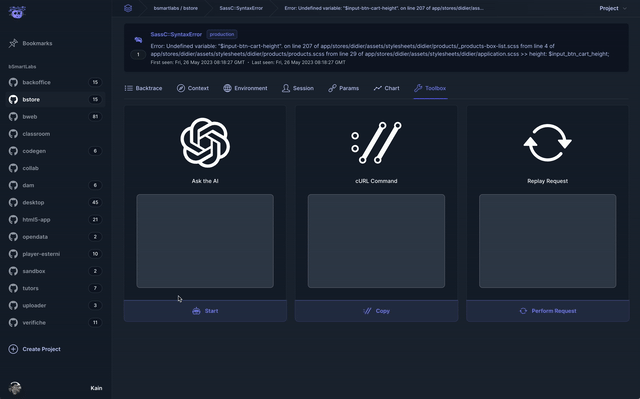

<p align="center">
  
  <h1 align="center">Open Source Error Catcher</h1>
</p>

<p align="center">
  <a aria-label="Build Status" href="https://github.com/icoretech/airbroke/actions/workflows/build.yml">
    
  </a>
  <a href="https://github.com/icoretech/airbroke/blob/main/LICENSE">
    
  </a>
  <a href="https://github.com/icoretech/airbroke/blob/main/package.json">
    
  </a>
</p>

<div align="center">
  
</div>

## Features

> Airbroke is currently in active development! Using it in production environments is at your own discretion. We appreciate your feedback and support as we work towards a stable release.

- :floppy_disk: Based on PostgreSQL
- :globe_with_meridians: Airbrake(tm)-compatible HTTP collector endpoint
- :computer: Modern, React-based frontend for error management
- :rocket: Designed with simplicity at its core
- :wrench: Maintains small database footprint even under heavy data ingestion
- :robot: Ask AI about issues
- :clipboard: Provide cURL command to reproduce HTTP exceptions
- :arrow_forward: Replay HTTP exceptions
- :key: Supports multiple OAuth providers for secure user authentication
- :bar_chart: Occurrence charts
- :bookmark: Save and manage bookmarks for important occurrences

## System Requirements

- Node.js 22/24+ compatible environment
- Minimum of 300MB RAM
- At least 1000 millicores, equivalent to 1 CPU core
- PostgreSQL 15+ database
- 8+ free database connections slots per instance

## Deployment Options

Airbroke provides flexibility in deployment options. You can either deploy it from the built source code or use a multiarch Docker image. For Kubernetes deployments, a Helm chart is provided. As Airbroke is a Next.js 16 application, it can be deployed wherever a Node.js server is supported. This includes managed environments such as Vercel, Netlify, and Heroku.

### Build from source

For a production build, you can run:

```sh
cp .env.dist .env
```

Then edit the `.env` file to set your own values.

```sh
yarn install
yarn build
```

This will generate a `build` folder that you can deploy to your server, but please refer to the `Dockerfile` to learn more about what to do after that because you might need to copy over some assets.

You can also run `yarn start` to test the production build locally on port `3000`.

### Docker

We publish images for both `amd64` and `arm64` architectures on [ghcr.io](https://github.com/icoretech/airbroke/pkgs/container/airbroke) but in case you want to build your own image you can do so.

You can build the Docker image with:

```sh
docker build --no-cache -t icoretech/airbroke:latest .
```

You can then run the image locally with:

```sh
docker run -p 3000:3000 icoretech/airbroke:latest
```

### Vercel

[](https://vercel.com/new/clone?repository-url=https%3A%2F%2Fgithub.com%2Ficoretech%2Fairbroke%2Ftree%2Fmain&env=DATABASE_URL,DIRECT_URL,AUTH_SECRET,AUTH_URL,AIRBROKE_CORS_ORIGINS&project-name=airbroke&repository-name=airbroke)

While [testing on Vercel](https://nextjs.org/learn/basics/deploying-nextjs-app/platform-details) has not been conducted, Airbroke should be fully compatible.

It's important to keep the following points in mind:

- For optimal performance, ensure your database is located in the same region.
- The endpoints under `/api/*` will be converted into serverless functions, which may introduce potential cold boot time.
- Due to the nature of serverless functions, your database connections will need to pass through a data proxy.
- When deploying with Vercel, migrations will need to be executed during the build step. Use the `prisma migrate deploy` command to apply migrations before Vercel proceeds with the deployment of serverless functions.

Detailed instructions for this process can also be found in the [Prisma deployment guide for Vercel](https://www.prisma.io/docs/guides/deployment/deployment-guides/deploying-to-vercel#prisma-workflow).

### Render.com

[](https://render.com/deploy?repo=https://github.com/icoretech/airbroke)

### Helm

You can deploy Airbroke to Kubernetes using the dedicated Helm chart.

The Helm chart includes a `values.yaml` file with some default values that you can override with your own. It also includes a pgBouncer chart as optional dependency.

When using Helm we recommend using a GitOps approach to deploy your application(s), such as [Flux](https://fluxcd.io/).

Please find more information about the Helm chart in the dedicated repository: [icoretech/charts](https://github.com/icoretech/helm/tree/main/charts/airbroke)

### Docker Compose

For users who prefer Docker Compose for managing multi-container Docker applications, a `docker-compose.yml` file is provided at the root of the repository.

To get started, make sure you have Docker and Docker Compose installed on your system. Then, you can start the application using the following command in the terminal:

```sh
make build
make run
```

You can override the default values in the `docker-compose.yml` file by creating a `docker-compose.override.yml` file in the same directory. This file is ignored by Git and will not be committed to the repository.

## Setup

Please view all the available configuration variables in the [`.env.dist`](https://github.com/icoretech/airbroke/blob/main/.env.dist) file.

Airbroke requires some environment variables set at runtime, `DATABASE_URL` and `DIRECT_URL` are mandatory, some examples:

```sh
# Example Connection to Prisma Data Proxy
DATABASE_URL="prisma://__HOST__/?api_key=__KEY__"
# Example Connection to PostgreSQL
DATABASE_URL="postgresql://__USER__:__PASSWORD__@__HOST__:__PORT__/__DATABASE__?connection_limit=20&pool_timeout=10&application_name=airbroke"
# Direct connection to the database, used for migrations
DIRECT_URL="postgresql://__USER__:__PASSWORD__@__HOST__:__PORT__/__DATABASE__"
```

The optimal connection pool size without pgBouncer (`connection_limit`) can be calculated using the following formula:

```ruby
connection_limit = (num_physical_cpus * 2 + 1) ÷ number_of_application_instances
```

For a system with 8 CPU cores and 3 application instances, the calculation would proceed as follows:

```ruby
connection_limit = (8 * 2 + 1) ÷ 3
connection_limit = (16 + 1) ÷ 3
connection_limit = 17 ÷ 3
connection_limit ≈ 5.67
```

Since `connection_limit` must be an integer, it should be rounded down to the nearest whole number. In this scenario, each of the 3 application instances should have a `connection_limit` of `5`.

This limit can be set in your connection strings.

After deployment, you should be able to access your ingress (preferably secured with HTTPS) and start adding projects.
This process will generate an API key that you can use with your Airbrake-compatible clients.
This key, along with other essential information, will be provided to you.

### About PgBouncer

To optimize your experience with Airbroke, as well as with Postgres overall, we advise integrating PgBouncer 1.24.0+ into your tech stack in transaction mode. For more comprehensive information, we recommend reviewing [Prisma's Connection Management documentation](https://www.prisma.io/docs/guides/performance-and-optimization/connection-management#external-connection-poolers), which provides insights on external connection poolers.
We recommend not setting `pgbouncer=true` in the database connection string if you're using **PgBouncer 1.21.0 or later** ([source](https://www.prisma.io/docs/orm/prisma-client/setup-and-configuration/databases-connections/pgbouncer)).

### About DIRECT_URL

The `DIRECT_URL` environment variable should be configured to establish a direct connection to the database. This is particularly crucial when using PgBouncer, as it enables migrations that cannot be executed through a data proxy. You can find more detailed information about this subject in the [Prisma's guide on configuring pgBouncer](https://www.prisma.io/docs/orm/prisma-client/setup-and-configuration/databases-connections/pgbouncer).

## Architecture

### Frontend

The Airbroke frontend provides a user-friendly interface for managing and analyzing error reports. It utilizes a modern tech stack, including React, Tailwind CSS, and Next.js, to deliver a seamless user experience. The frontend leverages server-rendering capabilities to optimize initial page load times and ensure fast and responsive navigation.

To optimize performance, the frontend may implement caching strategies to reduce the number of database queries and enhance overall responsiveness. This ensures that you can efficiently navigate through error reports and analyze critical information without experiencing unnecessary delays.

### Data Collection API

The Data Collection API is a core component of Airbroke responsible for handling the ingestion of error reports. It serves as the endpoint where clients can send error reports, enabling efficient data collection for error management.

To ensure simplicity and performance, the Data Collection API sidesteps the use of queue systems and performs parsing and transactions in-band. This means that parsing and processing of error reports happen synchronously within the API request cycle. Despite this approach, the Data Collection API demonstrates robust request-per-minute (RPM) performance even under high traffic volumes.

## Authentication Layer

Airbroke includes an authentication layer that allows you to secure access to the application by enabling user authentication. It supports various authentication providers, including:

- GitHub
- Atlassian
- Google
- Apple
- Authentik
- Cognito
- GitLab
- Keycloak
- Microsoft Entra ID
- Slack
- Okta

To configure the authentication layer, you need to set the necessary environment variables corresponding to the authentication providers you want to use. These environment variables typically include client IDs, client secrets, and other provider-specific configuration details. Make sure to keep these environment variables secure, as they contain sensitive information.

To complete the configuration, you also need to set the callback path in your OAuth applications for each provider. The callback path should be set to `https://<myhostname>/api/auth/callback/<provider>`. This path is where the authentication provider will redirect the user after successful authentication.

You can find a list of available authentication providers and their documentation on the [NextAuth.js Providers page](https://authjs.dev/getting-started/authentication/oauth). Each provider has its own specific configuration requirements and authentication flow, so refer to their documentation for more details.

To configure the authentication providers, you'll need to set specific environment variables. You can find the list of required environment variables and their descriptions in the [`.env.dist`](https://github.com/icoretech/airbroke/blob/main/.env.dist) file in the Airbroke repository.

To enable authentication in Airbroke and allow users to authenticate using third-party providers, follow these steps:

1. Configure the necessary environment variables for the desired authentication providers. You can refer to the [`.env.dist`](https://github.com/icoretech/airbroke/blob/main/.env.dist) file in the Airbroke repository for a list of required environment variables and their descriptions. Copy this file as `.env` and fill in the necessary values for your authentication providers.

2. Create OAuth applications with the respective authentication providers. Each provider will have its own developer console or settings page where you can create an OAuth application. During the application setup, configure the callback url to match the Airbroke authentication callback path: `https://myairbroke.xyz/api/auth/callback/<provider>`. Save the settings.

3. Start the Airbroke application, ensuring that the environment variables are properly configured.

4. Users can now authenticate with Airbroke by clicking on the login button and selecting their desired authentication provider. They will be redirected to the provider's authentication page to enter their credentials. Upon successful authentication, users will be logged in to Airbroke.

Note: The callback path in step 2 is essential for the authentication flow to work correctly. It ensures that the authentication provider can redirect the user back to the Airbroke application after authentication is complete.

Please refer to the documentation of the respective authentication providers to obtain the necessary configuration details and understand their authentication flows.

## Best Practices for Efficient Error Collection and Storage

Airbroke provides error grouping mechanisms that analyze the incoming error data and automatically group similar errors based on their attributes.

However when working with exceptions that include dynamic information as part of the exception itself (e.g., `raise(NotFound, 'no record 1234')`), it is important to consider efficient error collection and storage strategies. By following these practices, you can ensure that Airbroke maintains an efficient database and effectively groups and displays related errors without much overhead.

### Strategy 1: Use Generic Error Messages and Provide Detailed Reporting in `params`

If the exceptions are generated within your own code, consider using more generic error messages and providing detailed reporting using the `params` field. Here's an example:

```ruby
begin
  data = { book_id: 22 }
  raise 'ugh' # no dynamic data
rescue => e
  Airbrake.notify(e, data) # ugh happened on book_id 22
end
```

### Strategy 2: Collect and Wrap Exceptions Produced by Libraries

If the exceptions are produced by libraries, consider collecting the necessary information, wrapping the exceptions, and re-raising them with cleaned-up messages. This approach allows you to provide more meaningful and informative error messages to Airbroke. Here's an example:

```ruby
begin
  # Your code that interacts with a library
rescue SomeLibraryError => e
  # Collect necessary information
  error_data = { library_error_message: e.message, library_error_code: e.code }

  # Wrap and re-raise the exception with a cleaned-up message
  wrapped_exception = RuntimeError.new("An error occurred in the library.")
  Airbrake.notify(wrapped_exception, error_data)
  raise wrapped_exception
end
```

By wrapping the library exception with a customized error message and including the relevant information in the `params` field, you can ensure that Airbroke receives clean and consistent error messages while retaining the necessary context.

By adopting these best practices, you can enhance the efficiency and effectiveness of error collection and storage in Airbroke. These strategies allow for better grouping and analysis of related errors, providing you with the insights needed to identify and address issues more effectively.

### Limitations

When working with error collection in Airbroke, you may come across situations where you find an error occurrence with a high count, but upon opening it, you discover that it only has one document to consult. This happens because Airbroke groups errors based on their "kind" and "message". If any of these attributes differ, Airbroke will create a new error group.

As a result, you may encounter repeated errors that don't expose the specific parameter or stack trace after the first occurrence, or they may have originated from a different part of the application. This tradeoff is made to ensure a compact database size and high performance. The underlying idea is to encourage you to address and resolve errors, so maintaining a clean and organized error slate will yield better insights and improvements over time.

By understanding these limitations and keeping your error collection streamlined, you can effectively utilize Airbroke's features to identify and resolve issues in your application.
